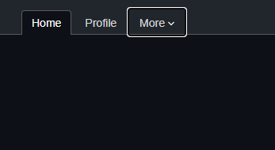

# ✔ Pure CSS

Checkdown is a pure CSS dropdown menu that utilizes the checkbox element.
 
Why checkbox? A checkbox is used in order to reliably switch between an open and closed state.

There are many other CSS tricks out there to create pure CSS dropdown menus. 
Many of them opens on mouse hover. This is not always desirable. 
Others open on click by using links and focus-within which might not be supported by older browsers. 

The checkbox element is cross browser compatible and is incredible reliable!

There is no "hack" involved, just a cleaver use of HTML elements. 
What is even better is that the dropdown menu is fully compatible with keyboard interactions. See images below:

