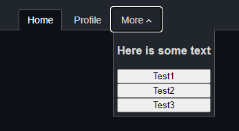

# ✔ Pure CSS

  

### Overview

Checkdown is a pure CSS dropdown menu. 
It is cross browser compatible and supports keyboard interaction.

### Browser Support

| OS         | Chrome  | Firefox  | Edge     | Opera | IE11 |
| -------- | ------- | -------- | -------- | ---- |  ---- |
| Android  | Yes     | Yes      | Yes      | Yes  |  Yes  | 
| iOS      | Yes     | Yes      | Yes      | Yes  |  Yes  | 
| Windows  | Yes     | Yes      | Yes      | Yes  |  Yes  | 
| Mac      | Yes     | Yes      | Yes      | Yes  |  Yes  | 

### Customization

Checkdown comes completely unstyled. 
This makes it easier to add your own style. 
To change the style of the dropdown button add your style to the `checkdown-label` class. 
To change the style of the dropdown container add your style to the `checkdown-content` class.

 
